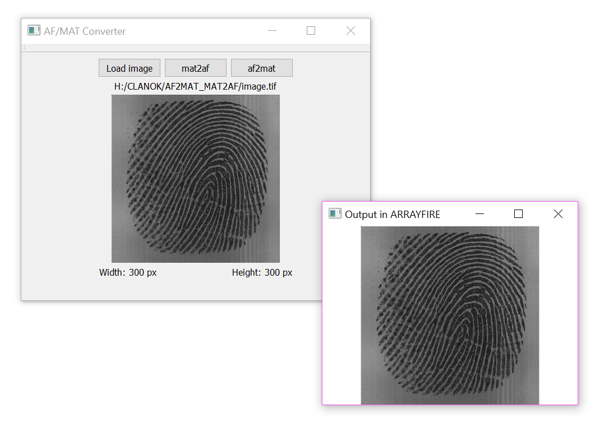

# ArrayFire/OpenCV Converter 

**Conversion functions** to help pass data between ArrayFire's `af::array` object and OpenCV's `cv::Mat`. In this Qt project we demonstrate possibility to pass **grayscale** (fingerprint) image data from `af::array` to `cv::Mat` and vice-versa. It is very common to use both ArrayFire and OpenCV library in image processing applications and therefore we find it helpful to provide these convenience conversion functions.

Please keep in mind that this conversion utility **works only for grayscale images**. To avoid errors, conversion functions check the image type and if not correct they raise exceptions.



This project **depends** on these 3rd-party libraries:
* [ArrayFire 3.6.1](https://github.com/arrayfire/arrayfire) (tested)
* [OpenCV 3.4.3](https://opencv.org/releases.html) (tested)

You need to provide valid paths to these libraries and their header files in `.pro` file. Your `.pro` file should look like as follows (in Windows 10):

```bash
# ArrayFire with CUDA backend
unix|win32: LIBS += -L'C:/Program Files/ArrayFire/v3/lib/' -lafcuda

INCLUDEPATH += 'C:/Program Files/ArrayFire/v3/include'
DEPENDPATH += 'C:/Program Files/ArrayFire/v3/include'

# OpenCV
win32:CONFIG(release, debug|release): LIBS += -L'C:/Program Files/opencv/build/x64/vc15/lib/' -lopencv_world343
else:win32:CONFIG(debug, debug|release): LIBS += -L'C:/Program Files/opencv/build/x64/vc15/lib/' -lopencv_world343d

INCLUDEPATH += 'C:/Program Files/opencv/build/include'
DEPENDPATH += 'C:/Program Files/opencv/build/include'
```

This project contains a class called `Converter` that has 2 static member functions to perform conversion:


```cpp
cv::Mat af2mat(const af::array& input);
```
This function takes `af::array` constant reference as input and returns a new `cv::Mat` containing a deep copy of input data.


```cpp
af::array mat2af(const cv::Mat& input);
```
This function takes `cv::Mat` constant reference as input and returns a new `af::array` containing a deep copy of input data.


Both functions do not allocate any extra dynamic memory, so users do not need to free anything just use the returned data until it is alive within its scope.

Here are some examples of using `Converter` class:

**Conversion from `af::array` to `cv::Mat`**

```cpp
// loading grayscale image
af::array input = af::loadImage(filename).as(u8);
try{
    // converting af::array to cv::Mat
    cv::Mat output = Converter::af2mat(input);
    // displaying cv::Mat
    cv::imshow("Output in OPENCV",output);
}
catch(QString& errorString){
    qCritical() << errorString;
}
```

**Conversion from `cv::Mat` to `af::array`**

```cpp
// loading grayscale image
cv::Mat input = cv::imread(filename,cv::IMREAD_GRAYSCALE);
try{
    // converting cv::Mat to af::array
    af::array output = Converter::mat2af(input);
    // displaying af::array
    af::Window window(output.dims(1), output.dims(0), "Output in ARRAYFIRE");
    do{
        window.image(output);
    } while(!window.close());
}
catch(QString& errorString){
    qCritical() << errorString;
}
```
